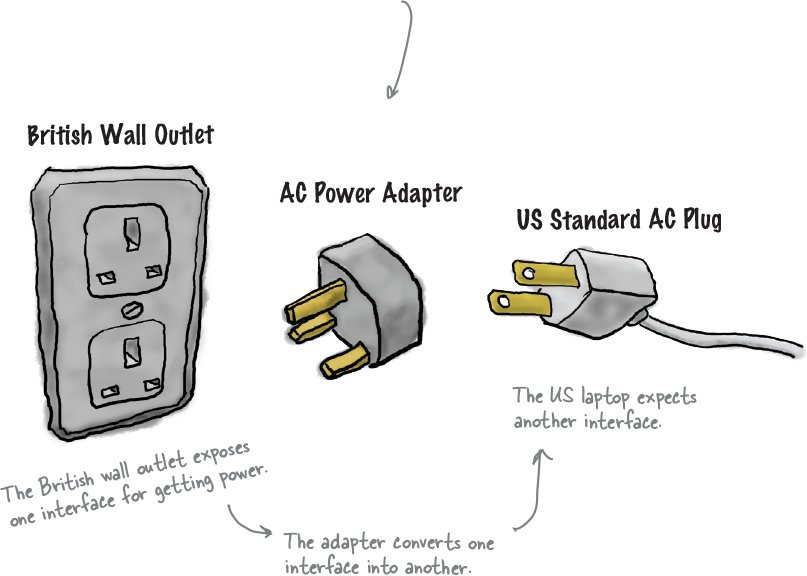
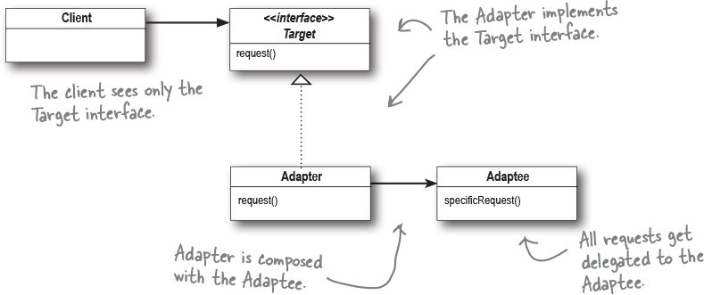

# Adaptor

adaptor take an interface and adapt it to one that a client is expecting. 
The Adapter Pattern converts the interface of a class into another interface the clients expect. Adapter lets classes work together that couldn’t otherwise because of incompatible interfaces. 

There are actually two kinds of adapters: object adapters and class adapters. former being the object adaptor. Object adapters and class adapters use two different means of adapting the adaptee (composition versus multiple inheritance).

* When you need to use an existing class and its interface is not the one you need, use an adapter.

* An adapter changes an interface into one a client expects.

* Implementing an adapter may require little work or a great deal of work depending on the size and complexity of the target interface.

* There are two forms of the Adapter Pattern: object and class adapters. Class adapters require multiple inheritance.

* An adapter wraps an object to change its interface, a decorator wraps an object to add new behaviors and responsibilities, and a facade “wraps” a set of objects to simplify.
