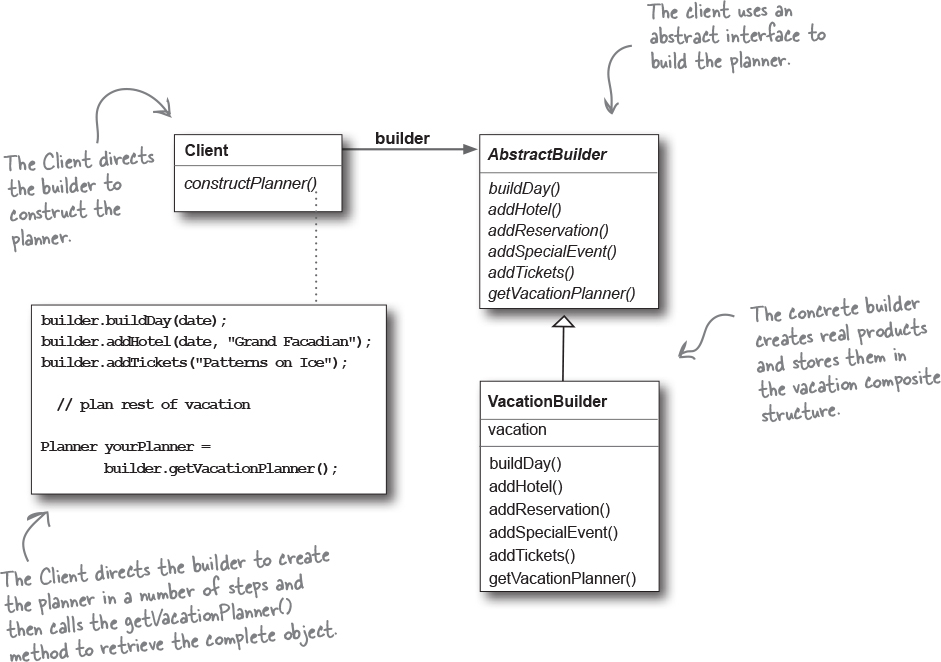

# Builder

When piecewise object construction is complicated, provide an API for doing it succinctly. Use the Builder Pattern to encapsulate the construction of a product and allow it to be constructed in steps. 

* Encapsulates the way a complex object is constructed.
* Allows objects to be constructed in a multistep and varying process (as opposed to one-step factories).
* Hides the internal representation of the product from the client.
* Product implementations can be swapped in and out because the client only sees an abstract interface.