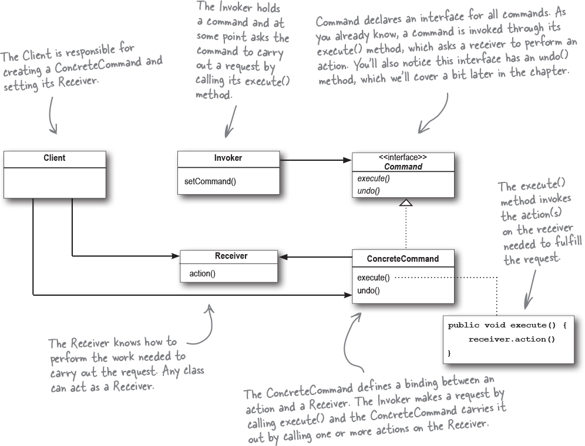

# Command

The Command Pattern encapsulates a request as an object, thereby letting you parameterize other objects with different requests, queue or log requests, and support undoable operations. 

A pattern that allows us to encapsulate methods into Command objects: store them, pass them around, and invoke them when you need them. Command object encapsulates a request by binding together a set of actions on a specific receiver. To achieve this, it packages the actions and the receiver into an object that exposes just one method, execute(). When called, execute() causes the actions to be invoked on the receiver. The Command Pattern allows you to decouple the requester of an action from the object that actually performs the action.

More uses
* Commands give us a way to package a piece of computation (a receiver and a set of actions) and pass it around as a first-class object (job queue).
* By using logging, we can save all the operations since the last checkpoint via storing the commands, and if there is a system failure, apply those operations to our checkpoint.

.

* The Command Pattern decouples an object making a request from the one that knows how to perform it.

* A Command object is at the center of this decoupling and encapsulates a receiver with an action (or set of actions).

* An invoker makes a request of a Command object by calling its execute() method, which invokes those actions on the receiver.

* Invokers can be parameterized with Commands, even dynamically at runtime.

* Commands may support undo by implementing an undo() method that restores the object to its previous state before the execute() method was last called.

* MacroCommands are a simple extension of the Command Pattern that allow multiple commands to be invoked. Likewise, MacroCommands can easily support undo().

* In practice, it’s not uncommon for “smart” Command objects to implement the request themselves rather than delegating to a receiver.

* Commands may also be used to implement logging and transactional systems.