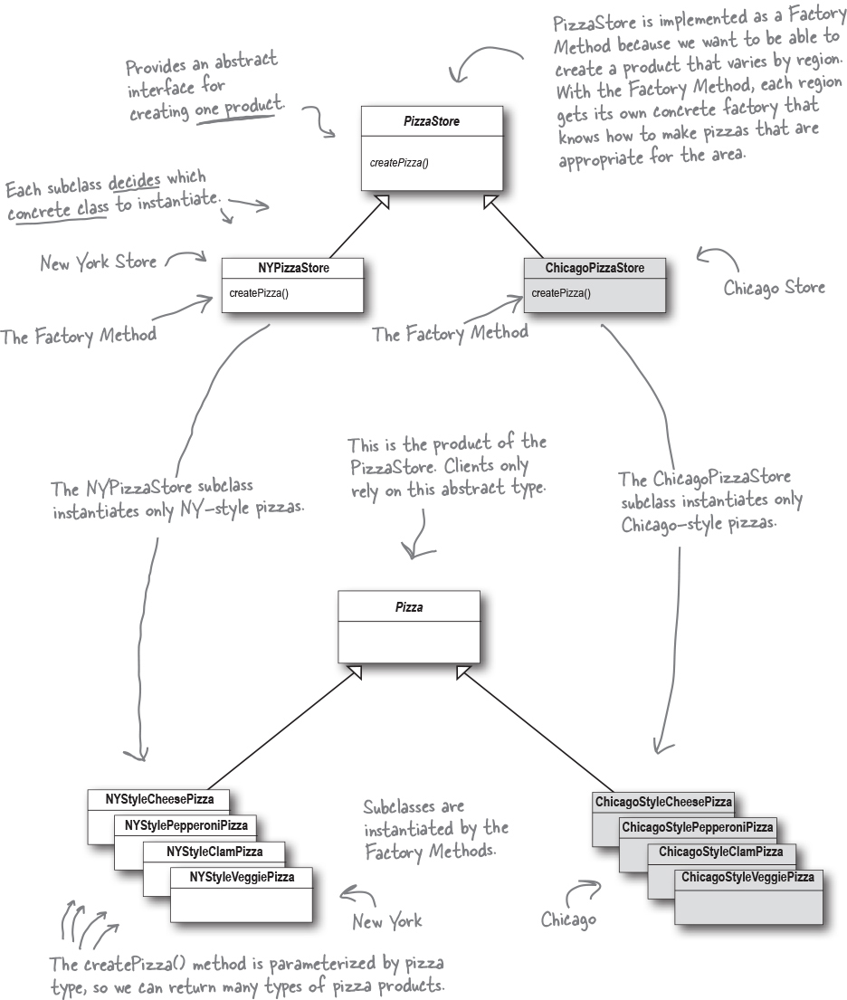

# Factory

The Simple Factory isn’t actually a Design Pattern (SimplePizzaFactory); it’s more of a programming idiom. But it is commonly used. 

The Factory Method Pattern defines an interface for creating an object, but lets subclasses decide which class to instantiate. Factory Method lets a class defer instantiation to subclasses.

Think of Simple Factory as a one-shot deal, while with Factory Method you are creating a framework that lets the subclasses decide which implementation will be used. For example, the orderPizza() method in the Factory Method Pattern provides a general framework for creating pizzas that relies on a factory method to actually create the concrete classes that go into making a pizza. By subclassing the PizzaStore class, you decide what concrete products go into making the pizza that orderPizza() returns. Compare that with Simple Factory, which gives you a way to encapsulate object creation, but doesn’t give you the flexibility of Factory Method because there is no way to vary the products you’re creating.

* All factories encapsulate object creation.
 
* Simple Factory, while not a bona fide design pattern, is a simple way to decouple your clients from concrete classes.
 
* Factory Method relies on inheritance: object creation is delegated to subclasses, which implement the factory method to create * objects.

* Abstract Factory relies on object composition: object creation is implemented in methods exposed in the factory interface.
 
* All factory patterns promote loose coupling by reducing the dependency of your application on concrete classes.
 
* The intent of Factory Method is to allow a class to defer instantiation to its subclasses.

* The intent of Abstract Factory is to create families of related objects without having to depend on their concrete classes.

* The Dependency Inversion Principle guides us to avoid dependencies on concrete types and to strive for abstractions.

* Factories are a powerful technique for coding to abstractions, not concrete classes.