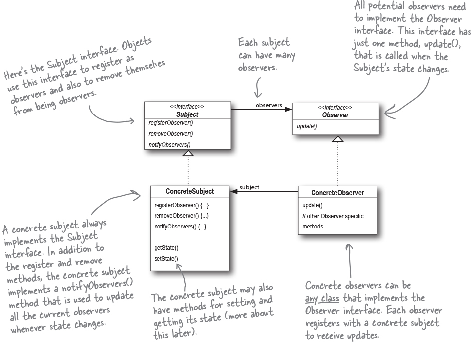

# Observer
The Observer Pattern is one of the most commonly used design patterns, and it’s incredibly useful. 

Publishers + Subscribers = Observer Pattern (Publish-Subscribe pattern is a more complex pattern )

The Observer Pattern defines a one-to-many dependency between objects so that when one object changes state, all of its dependents are notified and updated automatically. 

Loosely coupled designs allow us to build flexible OO systems that can handle change because they minimize the interdependency between objects. When two objects are loosely coupled, they can interact, but they typically have very little knowledge of each other. 

* The Observer Pattern defines a one-to-many relationship between objects.

* Subjects update Observers using a common interface.

* Observers of any concrete type can participate in the pattern as long as they implement the Observer interface.

* Observers are loosely coupled in that the Subject knows nothing about them, other than that they implement the Observer interface.

* You can push or pull data from the Subject when using the pattern (pull is considered more “correct”).

* The Observer Pattern is related to the Publish/Subscribe Pattern, which is for more complex situations with multiple Subjects and/or multiple message types.

* The Observer Pattern is a commonly used pattern, and we see it in Model-View-Controller.