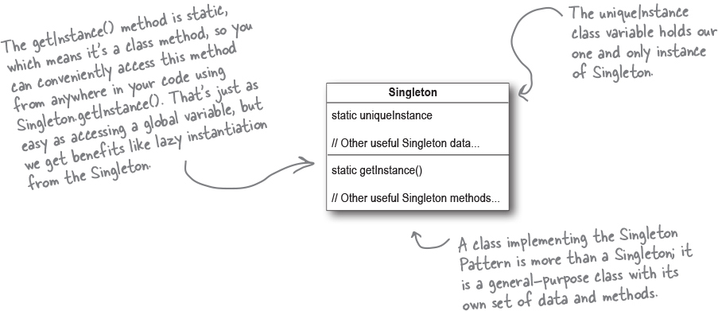

# Singleton

There are many objects we only need one of: thread pools, caches, dialog boxes, objects that handle preferences and registry settings, objects used for logging, and objects that act as device drivers to devices like printers and graphics cards.

The Singleton Pattern ensures a class has only one instance, and provides a global point of access to it. 

a common criticism of the Singleton Pattern is every object in the code that depends on the Singleton is going to be tightly coupled to that very specific object which violates the loose coupling principle. 

Is it okay to subclass a Singleton? - not really, Singletons are meant to be used sparingly. `I just showed a way how to use it, but it is not recommended. `

* The Singleton Pattern ensures you have at most one instance of a class in your application.

* The Singleton Pattern also provides a global access point to that instance.

* Singleton Pattern makes use of a private constructor, a static method combined with a static variable.

* Examine your performance and resource constraints and carefully choose an appropriate Singleton implementation for multithreaded applications (and we should consider all applications multithreaded!).