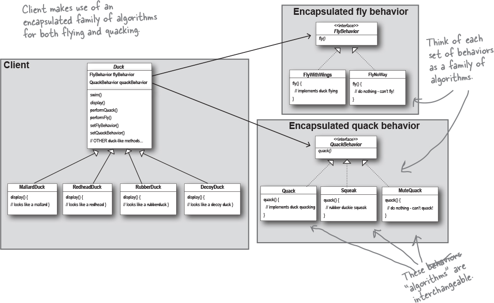

# Strategy

The one constant in software development: CHANGE

* Knowing the OO basics does not make you a good OO designer.
* Good OO designs are reusable, extensible, and maintainable.
* Favour composition over inheritance.
* Program to an interface, not an implementation
* Encapsulate what varies. 
* Patterns show you how to build systems with good OO design qualities.
* Patterns don’t give you code, they give you general solutions to design problems. You apply them to your specific application.
* Most patterns and principles address issues of change in software.
* Most patterns allow some part of a system to vary independently of all other parts.
* We often try to take what varies in a system and encapsulate it.
* Patterns provide a shared language that can maximize the value of your communication with other developers.

The Strategy Pattern defines a family of algorithms, encapsulates each one, and makes them interchangeable. Strategy lets the algorithm vary independently from clients that use it.  Ex: using the Strategy Pattern to implement the various behaviors of ducks. Take the parts that vary and encapsulate them, so that later you can alter or extend the parts that vary without affecting those that don’t.

creating systems using composition gives you a lot more flexibility. Not only does it let you encapsulate a family of algorithms into their own set of classes, but it also lets you change behavior at runtime as long as the object you’re composing with implements the correct behavior interface. 